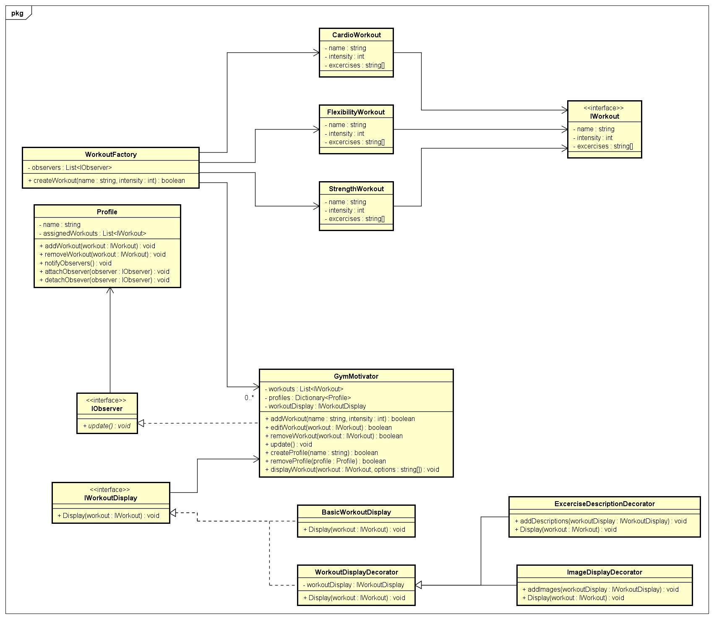

# Start Document

## Gym Motivator

### Application Description

The Gym Motivator is an application that aims to provide users with a platform to create and manage workout routines while offering motivational quotes to keep them inspired and motivated. The application will be developed in C# and will primarily target fitness enthusiasts and individuals looking for a structured approach to their workout routine.

### Features
_The functionalities are divided using MoSCoW analysis_
#### Must have
---
**Different workout creation** - A system that can create three different workout types: resistance, cardio and flexibility workouts.

**Motivational quote generator** - A system that retreives a single quote from a pool and displays it to the user.

**Live update** - A system that will automatically update the list of workouts depending on the actions of the user without the need to update the page.

**User Interface (UI)** - An UI through which the user can interact with the system.

#### Should have
---
**Motivational quote carouselle** - The retreived by the system will change after a certain period of time has passed.

**Customization** - Ability to customize already existing workouts by adding or removing excercises.

#### Could have
---
**Achievement** - Integration of motivational features such as achievement badges, inspirational quotes, or progress milestones to keep users motivated.

**Online availability** - Ability for the application to run online, not just locally.

#### Won't have
---
**Advanced analytics** - In-depth analytics and data visualization features for analyzing workout trends and patterns.

**Post-development support** - The application will not be updated after its development is finished.

### Design Patterns Used
##### Factory Method Pattern
**Purpose**: The Factory Method Pattern will be used to create workout routines dynamically based on user inputs. It solves the problem of creating objects without specifying their concrete classes, allowing for flexibility and extensibility in creating various types of workouts.
##### Observer Pattern
**Purpose**: The Observer Pattern will be implemented to update the application live after each input of the user (for example, creating, altering or deleting a workout). This will allow the application to have a much more pleasant user experience and prevent the UI from getting bloated by adding extra pages and buttons.
##### Singleton Pattern
**Purpose**: The Singleton Pattern's purpose in the application is to manage the retrieval of motivational quotes from an API. This pattern ensures that there is only one instance of the class responsible for fetching quotes, maintaining consistency and efficiency in quote retrieval across the application. It also ensures only one instance of the quote is present, this way preventing the application having to interact with the API excessively.
### Class Diagram

