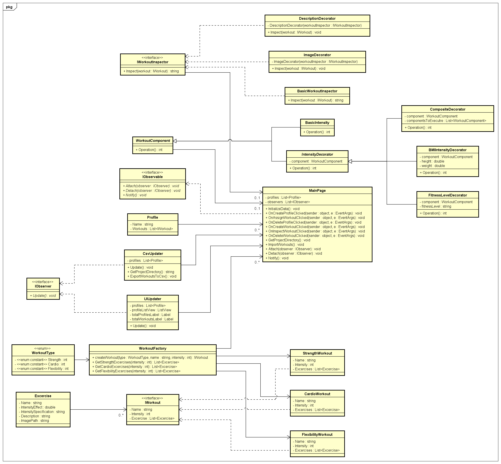

# Start Document

## Gym Motivator

By Evald Narkevičius (Student nr. 4981499) for Design Patterns at NHL Stenden Emmen.

### Application Description

Gym Workout manager is an open-source application designed for gyms who offer workout routines to their clients. The application creates pre-defined sets of workouts based on the user's input of workout type and intensity. With this data, the application calculates the intensity of the selected type of a workout and provides a list which then can be assigned to a profile to keep track of which workouts belong to which user.

### Features

- Creating workouts
- Creating profiles
- Assigning workouts
- List display of all profiles and their assigned workouts
- Deleting workouts
- Deleting profiles
- Live-updating all changes

### MoSCoW Analysis

#### Must have
---
**Different workout creation** - A system that can create three different workout types: strength, cardio and flexibility workouts.

**Modular display system** - The user can choose which data to display about their workouts.

**Live update** - A system that will automatically update the list of workouts depending on the actions of the user without the need to update the page.

**User Interface (UI)** - An UI through which the user can interact with the system.

#### Should have
---
**Motivational quote carouselle** - The application will spit motivational quotes at the user.

**Customization** - Ability to customize already existing workouts by adding or removing excercises.

#### Could have
---
**Achievements** - Integration of motivational features such as achievement badges, inspirational quotes, or progress milestones to keep users motivated.

**Online availability** - Ability for the application to run online, not just locally.

#### Won't have
---
**Advanced analytics** - In-depth analytics and data visualization features for analyzing workout trends and patterns.

**Post-development support** - The application will not be updated after its development is finished.

## Technology Used

- GitHub version management
- .NET MAUI front-end with C# back-end

### Design Patterns Used
##### Factory Method Pattern
**Purpose**: The Factory Method Pattern will be used to create workout routines dynamically based on user inputs. It solves the problem of creating objects without specifying their concrete classes, allowing for flexibility and extensibility in creating various types of workouts.
##### Observer Pattern
**Purpose**: The Observer Pattern will be implemented to update the application live after each input of the user (for example, creating, altering or deleting a workout or a profile). This will allow the application to have a much more pleasant user experience and prevent the UI from getting bloated by adding extra pages and buttons. The observer pattern will also ensure that on each input of the user the application will save the changes into a .csv file.
##### Decorator Pattern
**Purpose**: The Decorator Pattern will be implemented to let the user choose which data they would like to see about their workouts modularly. For example, the user can choose to display descriptions of their excercises or images, or even both.
### Class Diagram

### Group

This application is solly made by its author - Evald Narkevičius 
